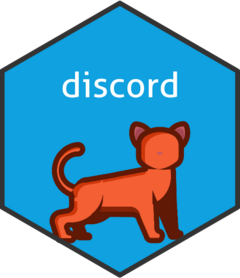

<!-- README.md is generated from README.Rmd. Please edit that file -->

```{r, include = FALSE}
knitr::opts_chunk$set(
  collapse = TRUE,
  comment = "#>",
  fig.path = "man/figures/README-",
  out.width = "100%"
)
```

# discord

<!-- badges: start -->
<a href="https://r-computing-lab.github.io/discord/"></a>
[](https://www.repostatus.org/#active)
[](https://cran.r-project.org/package=discord)
[](https://cran.r-project.org/package=discord)</br>
[](https://github.com/R-Computing-Lab/discord/actions/workflows/R-CMD-check.yaml)
[](https://github.com/R-Computing-Lab/discord/actions/workflows/R-CMD-dev_check.yaml)
[](https://app.codecov.io/gh/R-Computing-Lab/discord)


<!-- badges: end -->

`discord` is an R package that provides functions for discordant kinship
modeling and other sibling-based quasi-experimental designs. It includes
functions for data preparation, regression analysis, and simulation of
genetically-informed data. The package is designed to facilitate the
implementation of discordant sibling designs in research, allowing for
the control of shared familial confounding factors.

Visit the [discord website](https://r-computing-lab.github.io/discord/) for
more information and detailed documentation. Below is a brief overview of the package, its features, and vignettes to get you started.

## Features
- **Data Preparation**: Functions to prepare and structure data for discordant sibling analysis, including handling of kinship pairs and demographic variables.
- **Regression Analysis**: Tools to perform discordant regression analyses, allowing for the examination of within-family effects while controlling for shared familial confounders.
- **Simulation**: Functions to simulate genetically-informed data, enabling researchers to test and validate their models.

## Vignettes

The package includes several vignettes to help users understand and utilize its features effectively. 

## External Reproducible Examples

Beyond the vignettes, you can find additional examples that fully reproduce analyses from our other publications (Garrison et al 2025, etc). These examples can be accessed via the following links:

- National Longitudinal Survey of Youth (NLSY) dataset
  - [Frontiers](https://github.com/R-Computing-Lab/Sims-et-al-2024): Reproduces exploring the relationship between depression and delinquency from Sims et al 2024.
  - [AMPPS](https://github.com/R-Computing-Lab/target-causalclaims): Reproduces analyses from  Garrison et al 2025, using `targets` for workflow management.

- China Family Panel Studies (CFPS) dataset
  - [AMPPS](https://github.com/R-Computing-Lab/discord_AMPSS_CFPS): Reproduces analyses from the China Family Panel Studies (CFPS) dataset, focusing on the association between adolescent depression and math achievement.


## Installation

You can install the official version from CRAN

``` r
# Install/update discord with the release version from CRAN.
install.packages('discord')
```
You can also install/update discord with the development version of discord from [GitHub](https://github.com/) with:

``` r
# If devtools is not installed, uncomment the line below.
# install.packages('devtools')
devtools::install_github('R-Computing-Lab/discord')
```

## Citation

If you use `discord` in your research or wish to refer to it, please cite the following paper:

```{r eval=TRUE, comment=NA}
citation(package = "discord")
```


## Contributing
Contributions to the `discord` project are welcome. For guidelines on how to contribute, please refer to the [Contributing Guidelines](https://github.com/R-Computing-Lab/discord/blob/main/CONTRIBUTING.md). Issues and pull requests should be submitted on the GitHub repository. For support, please use the GitHub issues page.

## License
`discord` is licensed under the GNU General Public License v3.0. For more details, see the [LICENSE](https://github.com/R-Computing-Lab/discord/blob/main/LICENSE) file.
