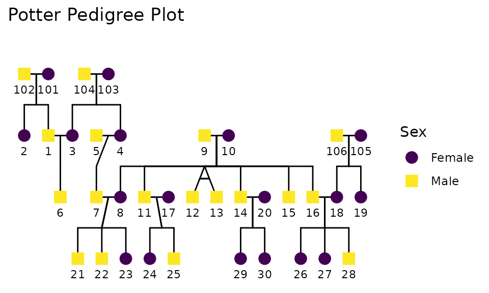

# Full Data Workflow

## Introduction

This vignette provides a complete workflow for conducting
discordant-kinship regression using the {discord} package. We encourage
you to read the accompanying paper (Garrison et al., 2025) for a full
explanation of the methods and their applications. We show how to
transform data into a format suitable for analysis, then walk through
standard OLS regression (for comparison) and discordant-kinship
regression.

The tutorial covers three common data structures (wide, long, and
pedigree formats) and uses simulated data for reproducibility. You can
adapt our R-based analysis pipeline to your own data by substituting
your variables and kinship links.

## Data Structures and Preparation

Your data likely exists in one of three common formats: wide, long, or
pedigree. Regardless of format, the goal is to create wide-format data
where each row represents a kinship pair. Variables for each member of
the pair are distinguished by suffixes (e.g., `_1` and `_2`).
Understanding your data structure determines which transformation steps
you’ll need. Each subsection below outlines how to handle these formats.

First, load the necessary packages:

``` r
# For easy data manipulation
library(dplyr)
library(tidyr)

# For kinship linkages
library(NlsyLinks)
# For discordant-kinship regression
library(discord)
# To clean data frames
library(janitor)
library(broom)
# For pipe
library(magrittr)
# For pedigree data manipulation
library(BGmisc)
# For pedigree plotting
library(ggpedigree)
library(ggplot2)
```

Once you load the necessary packages, feel free to skip to the relevant
subsection for your data type.

### Wide Format Data

Wide format is the most direct structure for our analysis. Each row
represents one kinship pair, with variables appearing twice—once for
each member of the pair—using suffixes to distinguish the two
individuals. For example, columns like `age_s1` and `age_s2`, where
`_s1` and `_s2` identify which sibling’s data appears in each column.

The simulated sibling data below contains five sibling pairs with
variables for ID, age, height, and weight for each sibling.

``` r
df_wide <- data.frame(
  pid = 1:5,
  id_s1 = c(101, 201, 301, 401, 501),
  id_s2 = c(102, 202, 302, 402, 502),
  age_s1 = c(30, 27, 40, 36, 30),
  age_s2 = c(28, 25, 38, 35, 28),
  height_s1 = c(175, 160, 180, 170, 165),
  height_s2 = c(170, 162, 178, 172, 168),
  weight_s1 = c(70, 60, 80, 75, 65),
  weight_s2 = c(68, 62, 78, 74, 66)
)

df_wide %>%
  slice(1:5) %>%
  knitr::kable()
```

| pid | id_s1 | id_s2 | age_s1 | age_s2 | height_s1 | height_s2 | weight_s1 | weight_s2 |
|----:|------:|------:|-------:|-------:|----------:|----------:|----------:|----------:|
|   1 |   101 |   102 |     30 |     28 |       175 |       170 |        70 |        68 |
|   2 |   201 |   202 |     27 |     25 |       160 |       162 |        60 |        62 |
|   3 |   301 |   302 |     40 |     38 |       180 |       178 |        80 |        78 |
|   4 |   401 |   402 |     36 |     35 |       170 |       172 |        75 |        74 |
|   5 |   501 |   502 |     30 |     28 |       165 |       168 |        65 |        66 |

In this example, `pid` is a unique identifier for each sibling pair.
Specifically, each row is anchored by a pair identifier. Variables
ending in `_s1` refer to one sibling, while those ending in `_s2` refer
to the other. In our case, the starting dataset is already arranged so
that the older sibling is `_s1` and the younger is `_s2`. Nevertheless,
this ordering will be adjusted later based on the outcome variable. If
your data already has this structure, you can skip ahead to the
“Ordering and Derived Variables” section.

### Long Format Data

Long format structures data with one row per individual. In other words,
each person appears in their own row, with a pair-identifier column
linking siblings. This format is common in many datasets (such as the
NLSY), but it requires transformation for our analysis.

We can demonstrate long format by reshaping our wide data from above
into long format using
[`pivot_longer()`](https://tidyr.tidyverse.org/reference/pivot_longer.html)
from the {tidyr} package:

``` r
df_long <- df_wide %>%
  tidyr::pivot_longer(
    cols = -pid, # keep the dyad identifier intact
    names_to = c(".value", "sibling"), # split base names and the sibling marker
    names_sep = "_s" # original suffix delimiter in column names
  )

df_long %>%
  slice(1:10) %>%
  knitr::kable()
```

| pid | sibling |  id | age | height | weight |
|----:|:--------|----:|----:|-------:|-------:|
|   1 | 1       | 101 |  30 |    175 |     70 |
|   1 | 2       | 102 |  28 |    170 |     68 |
|   2 | 1       | 201 |  27 |    160 |     60 |
|   2 | 2       | 202 |  25 |    162 |     62 |
|   3 | 1       | 301 |  40 |    180 |     80 |
|   3 | 2       | 302 |  38 |    178 |     78 |
|   4 | 1       | 401 |  36 |    170 |     75 |
|   4 | 2       | 402 |  35 |    172 |     74 |
|   5 | 1       | 501 |  30 |    165 |     65 |
|   5 | 2       | 502 |  28 |    168 |     66 |

Notice how each individual now occupies their own row. The `sibling`
column indicating whether each sibling was originally labeled `1` or
`2`. The `pid` column still identifies which individuals form a pair.

Suppose your data does not already have a unique identifier for each
kinship pair. In that case, you may need to construct one based on the
available information or download one from a kinship linkage resource.
Ideally, you will also have information about the type of kinship (e.g.,
full siblings, half-siblings, cousins) and whether they were raised
together or apart. (More on how to do this below for pedigree data.)

#### Converting Long to Wide

To convert long format data for discordant-kinship analysis, use
[`pivot_wider()`](https://tidyr.tidyverse.org/reference/pivot_wider.html)
from the {tidyr} package:

``` r
df_long2wide <- df_long %>%
  tidyr::pivot_wider(
    names_from = sibling, # the column that indicates the sibling number
    values_from = c(id, age, height, weight), # variables to spread into paired columns
    names_sep = "_s" # ensures id_s1, id_s2,etc
  )

df_long2wide %>%
  slice(1:5) %>%
  knitr::kable()
```

| pid | id_s1 | id_s2 | age_s1 | age_s2 | height_s1 | height_s2 | weight_s1 | weight_s2 |
|----:|------:|------:|-------:|-------:|----------:|----------:|----------:|----------:|
|   1 |   101 |   102 |     30 |     28 |       175 |       170 |        70 |        68 |
|   2 |   201 |   202 |     27 |     25 |       160 |       162 |        60 |        62 |
|   3 |   301 |   302 |     40 |     38 |       180 |       178 |        80 |        78 |
|   4 |   401 |   402 |     36 |     35 |       170 |       172 |        75 |        74 |
|   5 |   501 |   502 |     30 |     28 |       165 |       168 |        65 |        66 |

The reshaped data now reproduces our original wide format. Each analytic
variable appears twice with `_s1` and `_s2` suffixes, and the pair
identifier `pid` anchors each row.

#### Using existing kinship links

As mentioned before, if your long-format data lacks pair identifiers,
you’ll need to create them using family IDs, household identifiers, or
external kinship resources. This process can be straightforward if you
have access to family or household identifiers, and are confident in the
kinship relationships. However, it can be more complex if the
relationships are not clearly defined or if there are multiple types of
kinship (e.g., siblings, cousins, half-siblings) in your data.

For NLSY data specifically, the {NlsyLinks} package provides validated
kinship links for the vast majority of dyads in the NLSY79 and NLSY97
cohorts. These links are provided in wide format, and can be used to
left-join with the long-format data that the NLSY info website provides.
See the {NlsyLinks} documentation for more details on how to access and
use these datasets, or the reproducible source code for the analyses in
the primary paper (Garrison et al., 2025).

``` r
library(NlsyLinks)
data(Links79PairExpanded)

Links79PairExpanded %>%
  arrange(ExtendedID) %>%
  filter(RelationshipPath == "Gen1Housemates" & RFull == 0.5) %>%
  select(
    ExtendedID,
    SubjectTag_S1, SubjectTag_S2,
    RelationshipPath, RFull, IsMz,
    EverSharedHouse
  ) %>% # used to make the table
  slice_head(n = 5) %>%
  knitr::kable()
```

| ExtendedID | SubjectTag_S1 | SubjectTag_S2 | RelationshipPath | RFull | IsMz | EverSharedHouse |
|-----------:|--------------:|--------------:|:-----------------|------:|:-----|:----------------|
|          3 |           300 |           400 | Gen1Housemates   |   0.5 | No   | TRUE            |
|          5 |           500 |           600 | Gen1Housemates   |   0.5 | No   | TRUE            |
|         13 |          1300 |          1400 | Gen1Housemates   |   0.5 | No   | TRUE            |
|         17 |          1700 |          1800 | Gen1Housemates   |   0.5 | No   | TRUE            |
|         20 |          2000 |          2100 | Gen1Housemates   |   0.5 | No   | TRUE            |

As you can see, this dataset includes an extended family identifier
(`ExtendedID`), individual IDs for each sibling in the pair (`R0000100`
and `R0000200`), and their RelationshipPath (`RelationshipPath` =
“Gen1Housemates” and genetic relatedness (`RFull` = 0.5). You can merge
this dataset with your long-format data using the individual IDs.

At this stage the long‑origin data are indistinguishable from the
wide-origin wide example. Each analytic variable now appears exactly
twice—once for `_s1` and once for `_s2`—and the dyad identifier `pid`
continues to anchor the row. You can proceed directly to ordering and
construction of `*_mean` and `*_diff` with
[`discord_data()`](https://r-computing-lab.github.io/discord/reference/discord_data.md).

### Pedigree Data

Pedigree data is common in genetic and family studies, where detailed
family trees are available. It is long format data that provides rich
information about familial relationships, such as (mother ID, father ID,
spouse ID). Our research team has developed specialized tools in the
{BGmisc} package to extract kinship links and transform these pedigree
structures into a wide format suitable for analysis. Below is an example
of how such a dataset might look in both tabular and graphical forms:

``` r
data(potter)
ggpedigree(potter, config = list(
  label_method = "geom_text",
  label_nudge_y = .25,
  focal_fill_personID = 7,
  focal_fill_include = TRUE,
  focal_fill_force_zero = TRUE,
  focal_fill_na_value = "grey50",
  focal_fill_low_color = "darkred",
  focal_fill_high_color = "gold",
  focal_fill_mid_color = "orange",
  focal_fill_scale_midpoint = .65,
  focal_fill_component = "additive",
  focal_fill_method = "steps", #
  # focal_fill_method = "viridis_c",
  focal_fill_use_log = FALSE,
  focal_fill_n_breaks = 10,
  sex_color_include = F,
  focal_fill_legend_title = "Genetic Relatives \nof Harry Potter"
)) +
  labs(title = "Potter Pedigree Plot") +
  theme(legend.position = "right")
```



The pedigree tree above illustrates the family relationships among
individuals in the Potter dataset. Each node represents an individual,
and the lines connecting them indicate familial relationships such as
parent-child and sibling connections.

To work with pedigree data, we first need to convert it into a long
format data frame. The following code extracts relevant columns from the
`potter` dataset and adds a synthetic variable (`x_var`) for
demonstration purposes:

``` r
data(potter)
df_ped <- potter %>%
  as.data.frame() %>%
  select(
    personID, sex, famID, momID, dadID, spouseID,
    twinID, zygosity
  ) %>%
  mutate(x_var = round(rnorm(nrow(.), mean = 0, sd = 1), digits = 2))

df_ped %>%
  slice(1:5) %>%
  knitr::kable(digits = 2)
```

| personID | sex | famID | momID | dadID | spouseID | twinID | zygosity | x_var |
|---------:|----:|------:|------:|------:|---------:|-------:|:---------|------:|
|        1 |   1 |     1 |   101 |   102 |        3 |     NA | NA       | -1.40 |
|        2 |   0 |     1 |   101 |   102 |       NA |     NA | NA       |  0.26 |
|        3 |   0 |     1 |   103 |   104 |        1 |     NA | NA       | -2.44 |
|        4 |   0 |     1 |   103 |   104 |        5 |     NA | NA       | -0.01 |
|        5 |   1 |     1 |    NA |    NA |        4 |     NA | NA       |  0.62 |

As you can see, each individual is represented in a separate row, with
columns for their unique identifier, mother’s identifier, father’s
identifier, and other relevant variables. The {BGmisc} package provides
functions to compute kinship matrices from pedigree data. The package is
available on CRAN and GitHub. The package ( and its documentation ) can
be found at: <https://cran.r-project.org/web/packages/BGmisc/BGmisc.pdf>
as well as it’s accompanying Journal of Open Source Software paper:
<https://joss.theoj.org/papers/10.21105/joss.06203>

#### Computing Kinship Matrices

To transform this data into a wide format suitable for
discordant-kinship regression, we need to create kinship links based on
the pedigree information. To extract the necessary kinship information,
we need to compute two matrices: the additive genetic relatedness matrix
(add) and the shared environment matrix (cn). Other matrices, such as
mitochondrial, can also be computed if needed.

``` r
add <- ped2add(df_ped)
cn <- ped2cn(df_ped)
```

The
[`ped2add()`](https://r-computing-lab.github.io/BGmisc/reference/ped2add.html)
function computes the additive genetic relatedness matrix, which
quantifies the genetic similarity between individuals based on their
pedigree information. The
[`ped2cn()`](https://r-computing-lab.github.io/BGmisc/reference/ped2cn.html)
function computes the shared environment matrix, which indicates whether
individuals were raised in the same environment (1) or different
environments (0).

The resulting matrices are symmetric, with diagonal elements
representing self-relatedness (1.0). The off-diagonal elements represent
the relatedness between pairs of individuals, with values ranging from 0
(no relatedness) to 0.5 (full siblings) to 1 (themselves).

#### Creating Wide-Format Kinship Pairs

We convert the component matrices into a wide-form dataframe of kin
pairs using
[`com2links()`](https://r-computing-lab.github.io/BGmisc/reference/com2links.html).
Self-pairs and duplicate entries are removed.

``` r
df_links <- com2links(
  writetodisk = FALSE,
  ad_ped_matrix = add,
  cn_ped_matrix = cn,
  drop_upper_triangular = TRUE
) %>%
  filter(ID1 != ID2)

df_links %>%
  slice(1:5) %>%
  knitr::kable(digits = 3)
```

| ID1 | ID2 | addRel | cnuRel |
|----:|----:|-------:|-------:|
|   1 |   2 |   0.50 |      1 |
|   3 |   4 |   0.50 |      1 |
|   1 |   6 |   0.50 |      0 |
|   2 |   6 |   0.25 |      0 |
|   3 |   6 |   0.50 |      0 |

As you can see, the `df_links` data frame contains pairs of individuals
(ID1 and ID2) along with their additive genetic relatedness (`addRel`)
and shared environment status (`cnuRel`). These data are in wide format,
with each row representing a unique pair of individuals.

Further, we can tally the number of pairs by relatedness and shared
environment to understand the composition of the dataset.

``` r
df_links %>%
  group_by(addRel, cnuRel) %>%
  tally() %>%
  knitr::kable()
```

| addRel | cnuRel |   n |
|-------:|-------:|----:|
| 0.0625 |      0 |   3 |
| 0.1250 |      0 |  47 |
| 0.2500 |      0 | 104 |
| 0.5000 |      0 |  50 |
| 0.5000 |      1 |  32 |

This table shows the number of kinship pairs for each combination of
genetic relatedness and shared environment status. Although the discord
regression models can be used with any kin group, it is most
interpretable when there is a single kinship group.

Feel free to merge this `df_links` data frame with your pedigree data to
include additional variables for each individual in the pair.

The following optional subsection demonstrates how to simulate outcome
and predictor variables for these kinship pairs.

#### Simulating Outcome and Predictor Variables

To simulate outcome and predictor variables for our kinship pairs, we
can use the
[`kinsim()`](https://r-computing-lab.github.io/discord/reference/kinsim.md)
function from the {discord} package. This function allows us to generate
synthetic data based on specified genetic and environmental parameters.

For demonstration, we’ll focus on first cousins raised in separate homes
from our pedigree data.

``` r
df_cousin <- df_links %>%
  filter(addRel == .125) %>% # only cousins %>%
  filter(cnuRel == 0) # only kin raised in separate homes
```

`kinsim` allows us to generate synthetic data based on specified genetic
and environmental parameters or relatedness vectors. Here, we simulate
data for first cousins raised apart (addRel = 0.125, cnuRel = 0) using
the `df_links` data frame we created earlier.

``` r
set.seed(2024)

df_synthetic <- discord::kinsim(
  mu_all = c(1, 1), # means 
  cov_a = .5,
  cov_c = .1, # 
  cov_e = .3,
  c_vector = rep(df_cousin$cnuRel, 3),
  r_vector = rep(df_cousin$addRel, 3)
) 
```

I now have a synthetic dataset containing pairs of first cousins raised
apart, with simulated values for weight and height. Each row represents
a unique pair of cousins, with variables for each cousin distinguished
by the `_1` and `_2` suffixes. This data is designed such that our
weight and height variables have genetic (cov_a=.5) and environmental
correlations (cov_c=.1, cov_e=.3). By default, univariate ACE values are
1/3 genetic, 1/3 shared environment, and 1/3 unique environment. Also by
default,
[`kinsim()`](https://r-computing-lab.github.io/discord/reference/kinsim.md)
generates variables named `y1` and `y2` for the first and second
variables, respectively. We can rename these to more meaningful names
like `weight` and `height` for clarity.

``` r
df_synthetic <- df_synthetic %>%
  select(
    pid = id,
    r,
    weight_s1 = y1_1,
    weight_s2 = y1_2,
    height_s1 = y2_1,
    height_s2 = y2_2
  ) %>%
  mutate( # simulates age such that the 2nd sibling is between 1 and 5 years younger.
    age_s1 = round(rnorm(nrow(.), mean = 30, sd = 5), digits = 0),
    age_s2 = age_s1 - sample(1:5, nrow(.), replace = TRUE)
  )

df_synthetic %>%
  slice(1:5) %>%
  knitr::kable(digits = 2)
```

| pid |    r | weight_s1 | weight_s2 | height_s1 | height_s2 | age_s1 | age_s2 |
|----:|-----:|----------:|----------:|----------:|----------:|-------:|-------:|
|   1 | 0.12 |      2.09 |     -1.30 |      4.54 |     -0.66 |     31 |     30 |
|   2 | 0.12 |      1.21 |      0.40 |      1.20 |      0.26 |     32 |     28 |
|   3 | 0.12 |      1.03 |      2.53 |      2.76 |      0.58 |     29 |     27 |
|   4 | 0.12 |      1.46 |      4.92 |      0.93 |     -0.67 |     30 |     29 |
|   5 | 0.12 |      2.69 |      2.78 |      0.95 |     -0.54 |     23 |     18 |

This synthetic dataset now contains pairs of first cousins raised apart,
with simulated values for weight and height, as well as age. Each row
represents a unique pair of cousins, with variables for each cousin
distinguished by the `_s1` and `_s2` suffixes.

## Ordering and Derived Variables

Now that we have our data in wide format, we can proceed to order the
pairs and create the derived variables needed for discordant-kinship
regression. The key steps are:

1.  **Ordering the pairs**: We need to ensure that within each pair, the
    individual with the higher outcome value is consistently labeled as
    `_1` and the other as `_2`. This ordering is to ensure that we can
    extract meaningful difference scores.
2.  **Creating derived variables**: We will create `*_mean` and
    `*_diff*` variables for both the outcome and predictor variables.
    The `*_mean` variable represents the average of the two individuals’
    values, while the `*_diff` variable represents the difference
    between the two individuals’ values (i.e., `_1 - _2`).

These steps can be accomplished using the
[`discord_data()`](https://r-computing-lab.github.io/discord/reference/discord_data.md)
function from the {discord} package. This function takes care of
ordering the pairs and creating the derived variables, ensuring that the
data is ready for analysis. When using
[`discord_data()`](https://r-computing-lab.github.io/discord/reference/discord_data.md),
you will need to specify the outcome variable, predictor variables, and
the identifiers for the two members of each pair.

Below we default to pedigree data of cousins for reproducibility.
Replace with your chosen source as needed.

``` r
# CHOOSE ONE based on your path
# source_wide <- df_wide
# source_wide <- df_long2wide
source_wide <- df_synthetic # if you followed the pedigree path
```

Now call
[`discord_data()`](https://r-computing-lab.github.io/discord/reference/discord_data.md)
specifying the outcome and predictor present for both siblings. Here we
use `weight` as the outcome and `height` and `age` as the predictors,
with the `_s1` / `_s2` suffix convention.

``` r
df_discord_weight <- discord::discord_data(
  data = source_wide,
  outcome = "weight",
  predictors = c("height", "age"),
  demographics = "none",
  pair_identifiers = c("_s1", "_s2"),
  id = "pid" # or "famID"
)

df_discord_weight %>%
  slice(1:5) %>%
  knitr::kable(digits = 2, caption = "Transformed data ready for discordant-kinship regression")
```

|  id | weight_1 | weight_2 | weight_diff | weight_mean | height_1 | height_2 | height_diff | height_mean | age_1 | age_2 | age_diff | age_mean |
|----:|---------:|---------:|------------:|------------:|---------:|---------:|------------:|------------:|------:|------:|---------:|---------:|
|   1 |     2.09 |    -1.30 |        3.39 |        0.39 |     4.54 |    -0.66 |        5.20 |        1.94 |    31 |    30 |        1 |     30.5 |
|   2 |     1.21 |     0.40 |        0.81 |        0.80 |     1.20 |     0.26 |        0.94 |        0.73 |    32 |    28 |        4 |     30.0 |
|   3 |     2.53 |     1.03 |        1.51 |        1.78 |     0.58 |     2.76 |       -2.18 |        1.67 |    27 |    29 |       -2 |     28.0 |
|   4 |     4.92 |     1.46 |        3.46 |        3.19 |    -0.67 |     0.93 |       -1.60 |        0.13 |    29 |    30 |       -1 |     29.5 |
|   5 |     2.78 |     2.69 |        0.09 |        2.74 |    -0.54 |     0.95 |       -1.49 |        0.21 |    18 |    23 |       -5 |     20.5 |

Transformed data ready for discordant-kinship regression

### Understanding the Transformation

Let’s examine what
[`discord_data()`](https://r-computing-lab.github.io/discord/reference/discord_data.md)
did to our variables:

``` r
# Show original data for first 3 pairs
source_wide %>%
  slice(1:3) %>%
  select(pid, weight_s1, weight_s2, height_s1, height_s2) %>%
  knitr::kable(
    digits = 2,
    caption = "Original data: siblings not yet ordered by outcome"
  )
```

| pid | weight_s1 | weight_s2 | height_s1 | height_s2 |
|----:|----------:|----------:|----------:|----------:|
|   1 |      2.09 |     -1.30 |      4.54 |     -0.66 |
|   2 |      1.21 |      0.40 |      1.20 |      0.26 |
|   3 |      1.03 |      2.53 |      2.76 |      0.58 |

Original data: siblings not yet ordered by outcome

``` r

df_discord_weight %>%
  select(
    id,
    weight_1, weight_2, weight_mean, weight_diff,
    height_1, height_2, height_mean, height_diff
  ) %>%
  slice(1:3) %>%
  knitr::kable(digits = 2,
      caption = "After discord_data(): siblings ordered so weight_1 >= weight_2")
```

|  id | weight_1 | weight_2 | weight_mean | weight_diff | height_1 | height_2 | height_mean | height_diff |
|----:|---------:|---------:|------------:|------------:|---------:|---------:|------------:|------------:|
|   1 |     2.09 |    -1.30 |        0.39 |        3.39 |     4.54 |    -0.66 |        1.94 |        5.20 |
|   2 |     1.21 |     0.40 |        0.80 |        0.81 |     1.20 |     0.26 |        0.73 |        0.94 |
|   3 |     2.53 |     1.03 |        1.78 |        1.51 |     0.58 |     2.76 |        1.67 |       -2.18 |

After discord_data(): siblings ordered so weight_1 \>= weight_2

Notice several important patterns in this output. First, the ordering
changes depending on which sibling has the higher outcome value:

- If `weight_s1 > weight_s2` in the original data, sibling 1 becomes
  `_1` in the output
- If `weight_s2 > weight_s1` in the original data, the siblings are
  swapped: sibling 2 becomes `_1`
- The predictor values (height) are reordered accordingly to stay
  matched with the correct sibling

The sibling with higher weight becomes `_1` and the sibling with lower
weight becomes `_2`. This ordering ensures that `weight_diff`
(calculated as `weight_1 - weight_2`) is always non-negative. In the
case of ties, discord data randomly assigned one sibling as `_1` and
perserves that ordering throughout the dataset. Extremely motivated
readers can dive into the discord source code for exactly how this
calculation is implemented

Second, the mean scores represent each pair’s average weight. For
example, `weight_mean` equals the average of `weight_1` and `weight_2`.
These means capture between-family variation, reflecting differences
across sibling pairs so that we can compare families to one another.

Third, the predictor differences can be positive or negative. Even
though weight differences are always non-negative (by construction),
height differences vary. The taller sibling might be the heavier one, or
the shorter sibling might be heavier. This variation is what we’ll test
in our regression.

This structure lets us ask a key question: within sibling pairs, does
the sibling with more of the predictor also have more of the outcome? If
the taller sibling is systematically heavier even after controlling for
family background, that suggests height may causally influence weight.
If not, the association likely reflects familial confounding.

### Data Selection for Standard OLS Regression

For comparison, we also need to prepare data for a standard OLS
regression. When running a standard OLS regression, researchers
typically select one sibling per family to avoid non-independence.
Common approaches include:

- **First-born sibling**: The child born first in the family
- **Oldest sibling**: The sibling with the highest age at time of
  measurement
- **Random selection**: Randomly choosing one sibling from each pair

This selection is typically fixed based on a demographic characteristic
(birth order, age) and remains constant regardless of which outcome
variable you’re analyzing. In contrast, discordant-kinship regression
dynamically orders siblings based on the outcome variable. Thus each
analysis may involve different sibling orderings.

## Analyzing the Data

With our data prepared, we can now perform both standard OLS regression
and discordant-kinship regression to compare results.

### Standard OLS Regression

First, let’s run a standard OLS regression using the original
wide-format data. This will serve as a baseline for comparison with the
family-based analyses.

For our baseline analysis, we select one sibling from each pair. In the
original dataset, s1 was defined as the older sibling, so we can simply
choose the sibling labeled `_s1`. But, another way to select the oldest
sibling is to use the
[`discord_data()`](https://r-computing-lab.github.io/discord/reference/discord_data.md)
function with the `outcome` argument set to the age variable. This
approach will ensure that `_1` is always the oldest sibling within the
pair. In the case of ties, discord data randomly assigned one sibling as
`_1`. This assignment is preserved thru the entire data management
process.

``` r
df_for_ols <- df_synthetic %>%
  dplyr::select(
    id = pid,
    weight = weight_s1,
    height = height_s1,
    age = age_s1
  )


df_discord_age <- discord::discord_data(
  data = source_wide,
  outcome = "age",
  predictors = c("height", "weight"),
  demographics = "none",
  pair_identifiers = c("_s1", "_s2"),
  id = "pid" # or "famID" if you followed the pedigree path
)
```

The dataframes `df_for_ols` and `df_discord_age` now both contain one
sibling per pair, selected based on age. We can verify that they contain
the same individuals:

``` r
df_discord_age %>%
  select(
    id, age_1, age_2,
    age_mean, age_diff, weight_1, height_1
  ) %>%
  slice(1:5) %>%
  knitr::kable(caption = "One sibling per pair for OLS regression, selecting by age", digits = 2)
```

|  id | age_1 | age_2 | age_mean | age_diff | weight_1 | height_1 |
|----:|------:|------:|---------:|---------:|---------:|---------:|
|   1 |    31 |    30 |     30.5 |        1 |     2.09 |     4.54 |
|   2 |    32 |    28 |     30.0 |        4 |     1.21 |     1.20 |
|   3 |    29 |    27 |     28.0 |        2 |     1.03 |     2.76 |
|   4 |    30 |    29 |     29.5 |        1 |     1.46 |     0.93 |
|   5 |    23 |    18 |     20.5 |        5 |     2.69 |     0.95 |

One sibling per pair for OLS regression, selecting by age

``` r

df_for_ols %>%
  select(id, age, weight, height) %>%
  slice(1:5) %>%
  knitr::kable(caption = "One sibling per pair for OLS regression using original wide data", digits = 2)
```

|  id | age | weight | height |
|----:|----:|-------:|-------:|
|   1 |  31 |   2.09 |   4.54 |
|   2 |  32 |   1.21 |   1.20 |
|   3 |  29 |   1.03 |   2.76 |
|   4 |  30 |   1.46 |   0.93 |
|   5 |  23 |   2.69 |   0.95 |

One sibling per pair for OLS regression using original wide data

As you can see, `df_for_ols` and `df_discord_age` both resulted in the
same individuals being selected for analysis. The `df_discord_age`
dataset was created by ordering siblings based on age, ensuring that
`_1` is always the older sibling. The `df_for_ols` dataset directly
selects the older sibling from the original wide data.

By selecting one sibling per pair, we’re analyzing the same number of
observations as we have kinship pairs. This conrespondses with the
standard individual-level approach used in most research:

$$Y = \beta_{0} + \beta_{1}X1 + \beta_{2}X2 + \epsilon$$

``` r
ols_model <- lm(weight ~ height + age, data = df_for_ols)
```

``` r
stargazer::stargazer(ols_model,
  type = "html",ci=TRUE,
  digits = 3, single.row = TRUE, title = "Standard OLS Regression Results"
)
```

|                     |                                |
|---------------------|--------------------------------|
|                     |                                |
|                     | *Dependent variable:*          |
|                     |                                |
|                     | weight                         |
|                     |                                |
| height              | 0.287^(\*\*\*) (0.134, 0.440)  |
| age                 | -0.073^(\*\*) (-0.129, -0.017) |
| Constant            | 2.788^(\*\*\*) (1.081, 4.495)  |
|                     |                                |
| Observations        | 141                            |
| R²                  | 0.125                          |
| Adjusted R²         | 0.112                          |
| Residual Std. Error | 1.573 (df = 138)               |
| F Statistic         | 9.857^(\*\*\*) (df = 2; 138)   |
|                     |                                |
| *Note:*             | p\<0.1; p\<0.05; p\<0.01       |

**Standard OLS Regression Results**

``` r
stargazer::stargazer(ols_model,
  type = "latex",ci=TRUE,
  digits = 3, single.row = TRUE, title = "Standard OLS Regression Results"
)
```

This standard regression shows associations between our variables while
controlling only for measured covariates.

### Discordant Between-Family Regression

Next, we run a between-family regression using the discordant data. This
model regresses the outcome mean on predictor means, capturing
between-family variation:

$$Y_{mean} = \beta_{0} + \beta_{1}X1_{mean} + \beta_{2}X2_{mean} + \epsilon$$

``` r
between_model <- lm(
  weight_mean ~ height_mean + age_mean,
  data = df_discord_weight
)
```

``` r
stargazer::stargazer(between_model,
  type = "html",ci=TRUE,
  digits = 3, single.row = TRUE, title = "Between-Family Regression Results"
)
```

|                     |                               |
|---------------------|-------------------------------|
|                     |                               |
|                     | *Dependent variable:*         |
|                     |                               |
|                     | weight_mean                   |
|                     |                               |
| height_mean         | 0.199^(\*\*) (0.049, 0.350)   |
| age_mean            | -0.044^(\*) (-0.089, 0.001)   |
| Constant            | 2.064^(\*\*\*) (0.759, 3.368) |
|                     |                               |
| Observations        | 141                           |
| R²                  | 0.067                         |
| Adjusted R²         | 0.054                         |
| Residual Std. Error | 1.284 (df = 138)              |
| F Statistic         | 4.970^(\*\*\*) (df = 2; 138)  |
|                     |                               |
| *Note:*             | p\<0.1; p\<0.05; p\<0.01      |

**Between-Family Regression Results**

This between-family regression captures how differences in average
height and age across families relate to average weight. However, it
does not account for within-family differences, which is where
discordant-kinship regression comes in.

It is important to note that the between-family regression results are
not directly comparable to the standard OLS regression results. The
between-family model uses mean scores, which represent family-level
averages, while the OLS model uses individual-level data. Therefore, the
coefficients from these two models may differ in magnitude and
interpretation. But, they both provide useful information about the
relationships among the variables.

### Discordant-Kinship Regression

Now we return to our prepared data to run discordant-kinship regression.
We can specify the models manually or use the
[`discord_regression()`](https://r-computing-lab.github.io/discord/reference/discord_regression.md)
convenience function. Both approaches produce identical results.

The discordant model regresses the outcome difference on outcome mean,
predictor means, and predictor differences:

$$Y_{diff} = \beta_{0} + \beta_{1}Y_{mean} + \beta_{2}X1_{mean} + \beta_{3}X1_{diff} + \beta_{4}X2_{mean} + \beta_{5}X2_{diff} + \epsilon$$
When fitting the discordant regression model, the coefficient for each
`*_mean` variable captures the between-family effect, while the
coefficient for each `*_diff` variable captures the within-family
effect. The within-family effects are of particular interest, as they
provide insight into how differences between siblings relate to
differences in the outcome, controlling for shared family background.
Below you can see how this model is specified manually:

``` r

discord_model_manual <- lm(
  weight_diff ~ weight_mean + height_mean + height_diff + age_mean + age_diff,
  data = df_discord_weight
)

tidy(discord_model_manual, conf.int = TRUE) %>%
  knitr::kable(digits = 3, caption = "Discordant Regression (Manual)")
```

| term        | estimate | std.error | statistic | p.value | conf.low | conf.high |
|:------------|---------:|----------:|----------:|--------:|---------:|----------:|
| (Intercept) |    0.500 |     0.528 |     0.948 |   0.345 |   -0.544 |     1.544 |
| weight_mean |   -0.043 |     0.065 |    -0.660 |   0.511 |   -0.171 |     0.086 |
| height_mean |    0.041 |     0.060 |     0.680 |   0.498 |   -0.078 |     0.159 |
| height_diff |    0.141 |     0.043 |     3.254 |   0.001 |    0.055 |     0.226 |
| age_mean    |    0.031 |     0.018 |     1.742 |   0.084 |   -0.004 |     0.066 |
| age_diff    |   -0.026 |     0.024 |    -1.092 |   0.277 |   -0.074 |     0.021 |

Discordant Regression (Manual)

``` r
stargazer::stargazer(between_model, discord_model_manual,
  type = "html",ci=TRUE,
  digits = 3, single.row = TRUE, title = "Between-Family and Discordant Regression Results"
)
```

|                     |                               |                               |
|---------------------|-------------------------------|-------------------------------|
|                     |                               |                               |
|                     | *Dependent variable:*         |                               |
|                     |                               |                               |
|                     | weight_mean                   | weight_diff                   |
|                     | \(1\)                         | \(2\)                         |
|                     |                               |                               |
| weight_mean         |                               | -0.043 (-0.170, 0.084)        |
| height_mean         | 0.199^(\*\*) (0.049, 0.350)   | 0.041 (-0.077, 0.158)         |
| height_diff         |                               | 0.141^(\*\*\*) (0.056, 0.225) |
| age_mean            | -0.044^(\*) (-0.089, 0.001)   | 0.031^(\*) (-0.004, 0.066)    |
| age_diff            |                               | -0.026 (-0.074, 0.021)        |
| Constant            | 2.064^(\*\*\*) (0.759, 3.368) | 0.500 (-0.534, 1.534)         |
|                     |                               |                               |
| Observations        | 141                           | 141                           |
| R²                  | 0.067                         | 0.102                         |
| Adjusted R²         | 0.054                         | 0.069                         |
| Residual Std. Error | 1.284 (df = 138)              | 0.978 (df = 135)              |
| F Statistic         | 4.970^(\*\*\*) (df = 2; 138)  | 3.060^(\*\*) (df = 5; 135)    |
|                     |                               |                               |
| *Note:*             | p\<0.1; p\<0.05; p\<0.01      |                               |

**Between-Family and Discordant Regression Results**

Note that we are using the df_discord_weight dataset created earlier
with
[`discord_data()`](https://r-computing-lab.github.io/discord/reference/discord_data.md).
This dataset is ordered such that within a pair, the sibling with the
higher weight is always `_1`. This ordering ensures that `weight_diff`
is always non-negative, which is a key feature of discordant-kinship
regression.

#### Using the Helper Function

Alternatively, we can use the
[`discord_regression()`](https://r-computing-lab.github.io/discord/reference/discord_regression.md)
function, which simplifies the process:

By default,
[`discord_regression()`](https://r-computing-lab.github.io/discord/reference/discord_regression.md)
orders siblings by the outcome variable, creates the necessary derived
variables, and fits the discordant regression model in one step. This
function also allows for easy inclusion of demographic covariates if
needed. See the function documentation for more details on these
options, as well as a vignette focused on demographic controls.

``` r
discord_model <- discord_regression(
  data = source_wide,
  outcome = "weight",
  predictors = c("height", "age"),
  demographics = "none",
  sex = NULL,
  race = NULL,
  pair_identifiers = c("_s1", "_s2"),
  id = "pid"
)

tidy(discord_model, conf.int = TRUE) %>%
  knitr::kable(digits = 3, caption = "Discordant Regression Results")
```

| term        | estimate | std.error | statistic | p.value | conf.low | conf.high |
|:------------|---------:|----------:|----------:|--------:|---------:|----------:|
| (Intercept) |    0.500 |     0.528 |     0.948 |   0.345 |   -0.544 |     1.544 |
| weight_mean |   -0.043 |     0.065 |    -0.660 |   0.511 |   -0.171 |     0.086 |
| height_diff |    0.141 |     0.043 |     3.254 |   0.001 |    0.055 |     0.226 |
| age_diff    |   -0.026 |     0.024 |    -1.092 |   0.277 |   -0.074 |     0.021 |
| height_mean |    0.041 |     0.060 |     0.680 |   0.498 |   -0.078 |     0.159 |
| age_mean    |    0.031 |     0.018 |     1.742 |   0.084 |   -0.004 |     0.066 |

Discordant Regression Results

``` r

glance(discord_model) %>%
  select(r.squared, adj.r.squared, sigma, p.value, nobs) %>%
  knitr::kable(digits = 3)
```

| r.squared | adj.r.squared | sigma | p.value | nobs |
|----------:|--------------:|------:|--------:|-----:|
|     0.102 |         0.069 | 0.978 |   0.012 |  141 |

``` r
stargazer::stargazer(discord_model,
  discord_model_manual,
  type = "html",ci=TRUE,
  digits = 3, single.row = TRUE, title = "Discordant Regression Results Comparison"
)
```

% Error: Unrecognized object type.

Both the manual and helper function approaches yield identical results.

## Comparing the Three Approaches

To fully understand the value of discordant-kinship regression, it’s
helpful to compare all three models side by side. Each approach answers
a different question about the data.

### Side-by-Side Model Comparison

``` r
stargazer::stargazer(
  ols_model,
  between_model,
  discord_model_manual,
  type = "html",ci=TRUE,
  digits = 3,
  single.row = TRUE, 
  title = "Comparison of OLS, Between-Family, and Discordant Regression Models",
  column.labels = c("Standard OLS", "Between-Family", "Discordant"),
  model.names = FALSE
)
```

|                     |                                |                               |                               |
|---------------------|--------------------------------|-------------------------------|-------------------------------|
|                     |                                |                               |                               |
|                     | *Dependent variable:*          |                               |                               |
|                     |                                |                               |                               |
|                     | weight                         | weight_mean                   | weight_diff                   |
|                     | Standard OLS                   | Between-Family                | Discordant                    |
|                     | \(1\)                          | \(2\)                         | \(3\)                         |
|                     |                                |                               |                               |
| height              | 0.287^(\*\*\*) (0.134, 0.440)  |                               |                               |
| age                 | -0.073^(\*\*) (-0.129, -0.017) |                               |                               |
| weight_mean         |                                |                               | -0.043 (-0.170, 0.084)        |
| height_mean         |                                | 0.199^(\*\*) (0.049, 0.350)   | 0.041 (-0.077, 0.158)         |
| height_diff         |                                |                               | 0.141^(\*\*\*) (0.056, 0.225) |
| age_mean            |                                | -0.044^(\*) (-0.089, 0.001)   | 0.031^(\*) (-0.004, 0.066)    |
| age_diff            |                                |                               | -0.026 (-0.074, 0.021)        |
| Constant            | 2.788^(\*\*\*) (1.081, 4.495)  | 2.064^(\*\*\*) (0.759, 3.368) | 0.500 (-0.534, 1.534)         |
|                     |                                |                               |                               |
| Observations        | 141                            | 141                           | 141                           |
| R²                  | 0.125                          | 0.067                         | 0.102                         |
| Adjusted R²         | 0.112                          | 0.054                         | 0.069                         |
| Residual Std. Error | 1.573 (df = 138)               | 1.284 (df = 138)              | 0.978 (df = 135)              |
| F Statistic         | 9.857^(\*\*\*) (df = 2; 138)   | 4.970^(\*\*\*) (df = 2; 138)  | 3.060^(\*\*) (df = 5; 135)    |
|                     |                                |                               |                               |
| *Note:*             | p\<0.1; p\<0.05; p\<0.01       |                               |                               |

**Comparison of OLS, Between-Family, and Discordant Regression Models**

### Interpreting the Differences

For each model, we can summarize the key features, what they capture,
and how to interpret the results:

**Standard OLS Regression** provides estimates of associations between
variables at the individual level, controlling for measured covariates.
However, it does not account for unmeasured familial confounding, which
may bias the results. - **Data**: One sibling per family (e.g.,
first-born or older sibling)

- **Level of analysis**: Individual level

- **What it captures**: Total association between predictors and
  outcome, confounded by both genetic and environmental factors shared
  within families

- **Interpretation**: “Individuals with higher height and age tend to
  have higher weight”

**Between-Family Regression** compares kin from different families,
effectively controlling for all family-level unobserved heterogeneity.
While it provides a clearer picture of the effects of interest, it may
miss important individual-level variation within families. - **Data**:
Average values for each kin pair

- **Level of analysis**: Family level

- **What it captures**: How family-average predictors relate to
  family-average outcomes

- **Interpretation**: “Cousin pairs with higher average height and age
  tend to have higher average weight”

**Discordant Regression** focuses on within-family comparisons by
examining kin with differing outcomes. It allows for a nuanced
understanding of how individual-level factors interact above and beyond
familial confounding. - **Data**: Differences between cousins within
families

- **Level of analysis**: Within-family (controlling for between-family
  variation)

- **What it captures**: Within-family effects after controlling for
  shared genetic and environmental factors

- **Key coefficients**:

  - `*_mean`: Between-family effects (similar to between-family model)

  - `*_diff`: Within-family effects - the unique contribution of the
    predictor after controlling for familial confounding

- **Interpretation**: “The cousin with higher weight tends to have
  higher height and age”

- **Advantage**: Controls for unmeasured familial confounders, providing
  stronger evidence for (or against) causal effects \# Conclusion

Discordant-kinship regression offers a powerful tool for disentangling
within-family effects from between-family confounding. By leveraging
sibling and cousin comparisons, researchers can gain insights into
causal relationships that are often obscured in traditional analyses.

## Session Info

``` r
sessioninfo::session_info()
#> ─ Session info ───────────────────────────────────────────────────────────────
#>  setting  value
#>  version  R version 4.5.2 (2025-10-31)
#>  os       Ubuntu 24.04.3 LTS
#>  system   x86_64, linux-gnu
#>  ui       X11
#>  language en
#>  collate  C.UTF-8
#>  ctype    C.UTF-8
#>  tz       UTC
#>  date     2025-12-08
#>  pandoc   3.1.11 @ /opt/hostedtoolcache/pandoc/3.1.11/x64/ (via rmarkdown)
#>  quarto   NA
#> 
#> ─ Packages ───────────────────────────────────────────────────────────────────
#>  package      * version date (UTC) lib source
#>  backports      1.5.0   2024-05-23 [1] RSPM
#>  BGmisc       * 1.5.0   2025-07-19 [1] RSPM
#>  broom        * 1.0.11  2025-12-04 [1] RSPM
#>  bslib          0.9.0   2025-01-30 [1] RSPM
#>  cachem         1.1.0   2024-05-16 [1] RSPM
#>  cli            3.6.5   2025-04-23 [1] RSPM
#>  data.table     1.17.8  2025-07-10 [1] RSPM
#>  desc           1.4.3   2023-12-10 [1] RSPM
#>  digest         0.6.39  2025-11-19 [1] RSPM
#>  discord      * 1.3     2025-12-08 [1] local
#>  dplyr        * 1.1.4   2023-11-17 [1] RSPM
#>  evaluate       1.0.5   2025-08-27 [1] RSPM
#>  farver         2.1.2   2024-05-13 [1] RSPM
#>  fastmap        1.2.0   2024-05-15 [1] RSPM
#>  fs             1.6.6   2025-04-12 [1] RSPM
#>  generics       0.1.4   2025-05-09 [1] RSPM
#>  ggpedigree   * 1.0.0.1 2025-11-30 [1] RSPM
#>  ggplot2      * 4.0.1   2025-11-14 [1] RSPM
#>  glue           1.8.0   2024-09-30 [1] RSPM
#>  gtable         0.3.6   2024-10-25 [1] RSPM
#>  htmltools      0.5.9   2025-12-04 [1] RSPM
#>  htmlwidgets    1.6.4   2023-12-06 [1] RSPM
#>  janitor      * 2.2.1   2024-12-22 [1] RSPM
#>  jquerylib      0.1.4   2021-04-26 [1] RSPM
#>  jsonlite       2.0.0   2025-03-27 [1] RSPM
#>  knitr          1.50    2025-03-16 [1] RSPM
#>  labeling       0.4.3   2023-08-29 [1] RSPM
#>  lattice        0.22-7  2025-04-02 [3] CRAN (R 4.5.2)
#>  lifecycle      1.0.4   2023-11-07 [1] RSPM
#>  lubridate      1.9.4   2024-12-08 [1] RSPM
#>  magrittr     * 2.0.4   2025-09-12 [1] RSPM
#>  Matrix         1.7-4   2025-08-28 [3] CRAN (R 4.5.2)
#>  NlsyLinks    * 2.2.3   2025-08-31 [1] RSPM
#>  pillar         1.11.1  2025-09-17 [1] RSPM
#>  pkgconfig      2.0.3   2019-09-22 [1] RSPM
#>  pkgdown        2.2.0   2025-11-06 [1] any (@2.2.0)
#>  purrr          1.2.0   2025-11-04 [1] RSPM
#>  quadprog       1.5-8   2019-11-20 [1] RSPM
#>  R6             2.6.1   2025-02-15 [1] RSPM
#>  ragg           1.5.0   2025-09-02 [1] RSPM
#>  RColorBrewer   1.1-3   2022-04-03 [1] RSPM
#>  rlang          1.1.6   2025-04-11 [1] RSPM
#>  rmarkdown      2.30    2025-09-28 [1] RSPM
#>  S7             0.2.1   2025-11-14 [1] RSPM
#>  sass           0.4.10  2025-04-11 [1] RSPM
#>  scales         1.4.0   2025-04-24 [1] RSPM
#>  sessioninfo    1.2.3   2025-02-05 [1] RSPM
#>  snakecase      0.11.1  2023-08-27 [1] RSPM
#>  stargazer      5.2.3   2022-03-04 [1] RSPM
#>  stringi        1.8.7   2025-03-27 [1] RSPM
#>  stringr        1.6.0   2025-11-04 [1] RSPM
#>  systemfonts    1.3.1   2025-10-01 [1] RSPM
#>  textshaping    1.0.4   2025-10-10 [1] RSPM
#>  tibble         3.3.0   2025-06-08 [1] RSPM
#>  tidyr        * 1.3.1   2024-01-24 [1] RSPM
#>  tidyselect     1.2.1   2024-03-11 [1] RSPM
#>  timechange     0.3.0   2024-01-18 [1] RSPM
#>  vctrs          0.6.5   2023-12-01 [1] RSPM
#>  withr          3.0.2   2024-10-28 [1] RSPM
#>  xfun           0.54    2025-10-30 [1] RSPM
#>  yaml           2.3.11  2025-11-28 [1] RSPM
#> 
#>  [1] /home/runner/work/_temp/Library
#>  [2] /opt/R/4.5.2/lib/R/site-library
#>  [3] /opt/R/4.5.2/lib/R/library
#>  * ── Packages attached to the search path.
#> 
#> ──────────────────────────────────────────────────────────────────────────────
```
